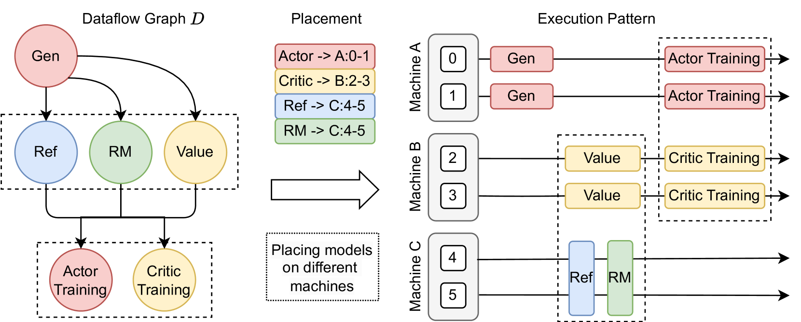
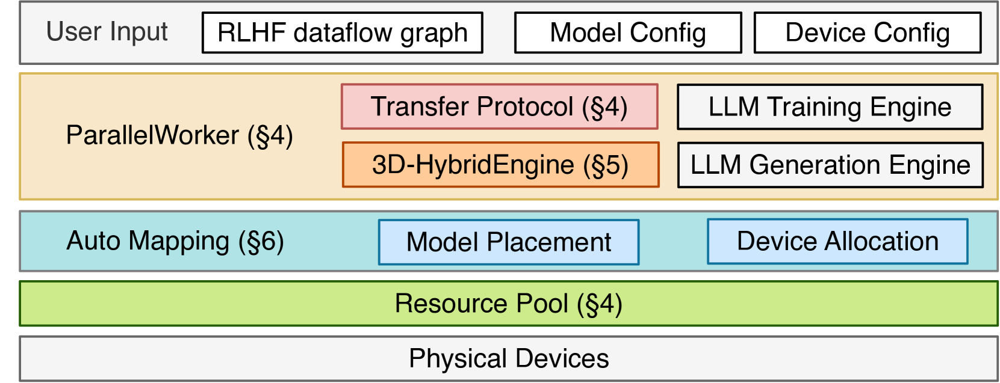
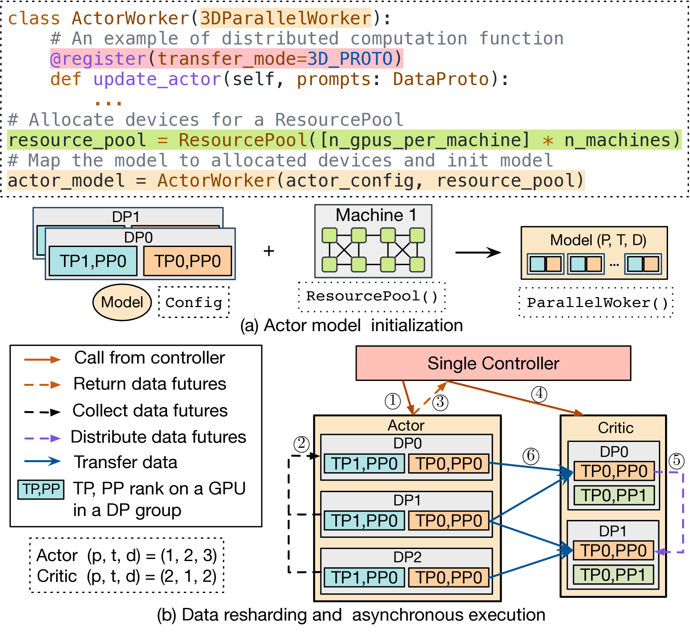
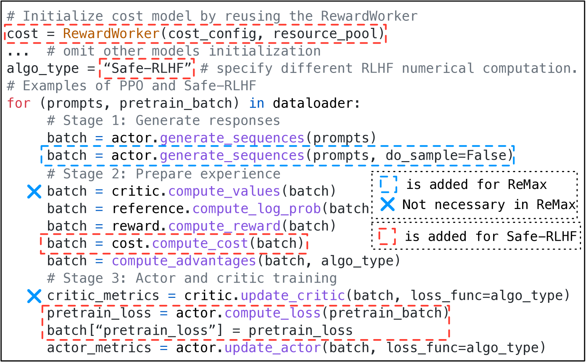
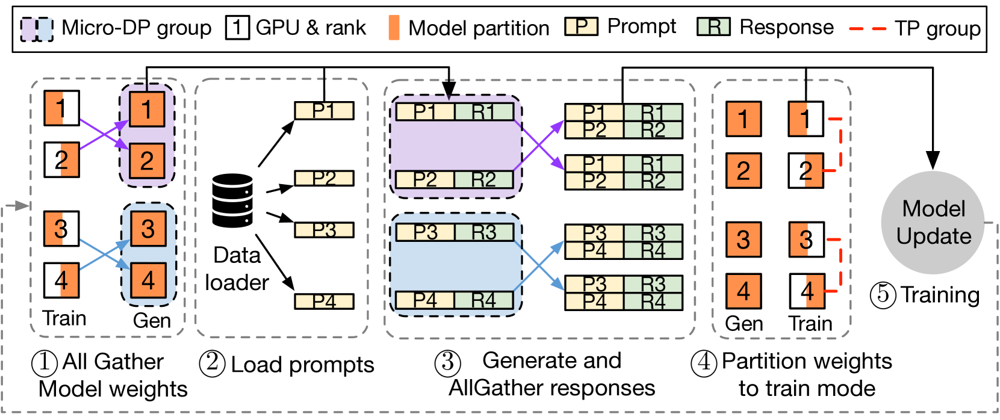

# 第二部分：veRL 的核心算法引擎 HybridFlow
## 1. HybridFlow 的设计理念
HybridFlow 作为 veRL 的核心算法引擎，其设计理念在于结合单控制器（Single-Controller）的灵活性和多控制器（Multi-Controller）的效率，以优化强化学习特别是人类反馈强化学习（RLHF）的数据流管理1。在传统的强化学习框架中，数据流（DataFlow）通常由单个控制器来管理，负责指导节点内的计算（intra-node computation）和节点间的通信（inter-node communication）。然而，对于设计大型语言模型的 RLHF 任务，这种方式可能会由于分布式节点内计算的控制调度开销（control dispatch overhead）过大而变得效率低下1。现有的 RLHF 系统通常采用多控制器模式，但这种模式在嵌套分布式计算和数据通信时会显得不够灵活1 。

  
   Figure 1: HybridFlow 数据流

HybridFlow 的核心架构采用了分层的混合编程模型1。在节点层面，HybridFlow 提供了一系列模型类，这些类封装了不同 LLM 在数据流中的分布式计算（训练、推理和生成）过程，并将其抽象为统一的 API 2。在节点间层面，HybridFlow 利用单控制器模式来灵活地表达各种数据依赖关系，并协调节点间的数据重分片（data resharding），从而降低开销3。这种混合模式使得用户能够以极少的代码行实现复杂的 RLHF 数据流，并通过单个控制器的单个进程运行 RLHF 任务，极大地简化了分布式计算的复杂性2 。

  
   Figure 2: HybridFlow 架构

HybridFlow 的架构中引入了资源池（ResourcePool）的概念 。资源池能够虚拟化一组 GPU 资源，并为每个模型分配计算资源。不同的资源池实例可以对应不同的设备集合，从而支持将不同的模型部署在相同或不同的 GPU 组上 。这种灵活的模型部署方法能够满足不同算法、模型和硬件环境的资源和性能需求 。

此外，HybridFlow 支持异步的强化学习控制流 。在 HybridFlow 中，控制流部分采用单控制器架构，能够灵活地实现异步的 RL 控制流。对于部署在同一组设备上的模型，HybridFlow 通过调度机制实现顺序执行，以避免资源竞争和冲突 。

  
   Figure 3: HybridFlow Data resharding and asynchronous execution

传统的强化学习框架（如 RLLib 和 RLLib Flow），通常采用分层的单控制器模式来运行 RL 数据流，由一个中央控制器将数据流中的节点分配给不同的进程并协调它们的执行顺序 。相比于这些传统的强化学习框架，HybridFlow 通过其混合模式，在保证灵活性的同时，提高了处理大规模语言模型 RLHF 任务的效率 。

~~~
参考资料：
1. HybridFlow: https://www.aibase.com/news/12936
2. a bran new RLHF framework: https://team.doubao.com/en/blog/%E6%9C%80%E9%AB%98%E6%8F%90%E5%8D%8720%E5%80%8D%E5%90%9E%E5%90%90%E9%87%8F-%E8%B1%86%E5%8C%85%E5%A4%A7%E6%A8%A1%E5%9E%8B%E5%9B%A2%E9%98%9F%E5%8F%91%E5%B8%83%E5%85%A8%E6%96%B0-rlhf-%E6%A1%86%E6%9E%B6-%E7%8E%B0%E5%B7%B2%E5%BC%80%E6%BA%90
3. HybridFlow: A Flexible and Efficient RLHF Framework: https://www.youtube.com/watch?v=R-vNUjaTS6w
4. HybridFlow: A Flexible and Efficient RLHF Framework: https://arxiv.org/abs/2409.19256
5. HybridFlow Programming Guide: https://verl.readthedocs.io/en/latest/hybrid_flow.html
~~~

## 2. HybridFlow 支持的算法框架与扩展性
HybridFlow 引擎原生支持多种用于大型语言模型对齐的先进强化学习算法框架 。这些算法包括： 
 - **近端策略优化（Proximal Policy Optimization，PPO）**：一种策略梯度算法，通过限制每次更新的策略变化幅度来保证训练的稳定性 。
 - **广义奖励策略优化（Generalized Reward Policy Optimization，GRPO）**：一种基于广义奖励函数优化策略的算法，可能与 LLM 对齐中的人类反馈相关 。
 - **分布式的 Actor-Policy 优化（Distributional Actor-Policy Optimization，DAPO）**：一种 Actor-Critic 算法，在提升 LLM 的推理能力方面表现出色，采用了如 Clip-Higher、动态采样和 Token 级策略梯度损失等技术 。
 - ~~**其他算法**：veRL 还支持多种其他强化学习算法，包括 ReMax、REINFORCE++、RLOO、PRIME、DrGRPO 以及即将推出的 VAPO 等，为不同的强化学习任务提供了丰富的工具集 。~~

~~~
**待补充内容**：
 - [ ] HybridFlow 是否原生支持 PPO、GRPO、DAPO等算法 ？？？有待进一步考证
~~~

  
   Figure 4: Implementation of PPO, ReMax and Safe-RLHF

 HybridFlow 的设计强调扩展性，其控制流和计算流的解耦使得用户可以轻松地扩展以支持新的或自定义的强化学习算法 。用户可以定义自己的控制逻辑，而无需修改底层的计算引擎。

 此外，HybridFlow 通过其模块化设计和与 HuggingFace Transformers 的集成，能够与各种 LLM 架构无缝协作 。这包括对 Qwen、Llama、Gemma 和 DeepSeek 等流行模型架构的支持，极大地增强了平台的通用性。

 总而言之，HybridFlow 不仅原生支持多种关键的 LLM 对齐强化学习算法，而且具有高度的扩展性，允许用户集成自定义算法，并通过其模块化设计和 HuggingFace 集成利用各种 LLM 架构。

## 3. HybridFlow 的性能优化策略
HybridFlow 引擎采用了多种性能优化策略，以确保在处理大规模语言模型的强化学习任务时能够实现高效率：
 - ~~**高效的数据处理**：HybridFlow 优化了强化学习训练过程中的数据处理，采用了如序列打包（Sequence Packing）等技术，并支持多种数据传输协议，以减少通信开销，提高数据处理效率 。~~
 - **3D-HybridEngine 实现 Actor 模型重分片**：3D-HybridEngine 是 HybridFlow 的核心组件，专门用于优化 Actor 模型在训练和生成阶段之间的转换 。它通过优化的并行分组方法，实现了零冗余的模型参数重组，从而最小化了内存冗余和通信开销 。
 - **模型部署的自动映射**：HybridFlow 具备自动映射（Auto Mapping）功能，能够基于模型负载和数据依赖性自动将模型部署到不同的设备上，并选择最优的并行策略 。这简化了模型部署过程，并提高了训练效率 。
~~~
这里需要测试一下模型部署，到目前为止，我还没有使用 verl 真正的测试过模型训练的效果
~~~
 - **集成高性能库**：HybridFlow 集成了如 Flash Attention 2 和 DeepSpeed Ulysses 等高性能库，以进一步提升性能，并支持更大规模的模型训练 。

  
   Figure 5: Implementation of PPO, ReMax and Safe-RLHF

通过这些策略，HybridFlow 旨在为大规模语言模型的强化学习提供最先进的吞吐量和效率。实验结果表明，在使用 128 个 GPU 的集群上，HybridFlow 相较于现有最先进的基线系统，实现了 1.53 倍到惊人的 20.57 倍的加速 。

总而言之，HybridFlow 通过高效的数据处理、创新的 3D-HybridEngine、自动化的模型部署和并行策略选择，以及与高性能库的集成，实现了卓越的性能。

## 4. 如何在 veRL 中配置和使用 HybridFlow
在 veRL 中配置和使用 HybridFlow 引擎通常涉及以下步骤：
 - **配置文件的使用**：veRL 使用配置文件（通常是 YAML 格式）来定义 HybridFlow 引擎的参数 。这些配置文件允许用户设置模型并行度、指定数据路径以及配置其他相关的选项。例如，用户可以在配置文件中选择使用 FSDP 或 Megatron 作为训练后端，并设置相应的并行策略参数 。
 - **API 的使用**：veRL 提供了结构化的 API，用于与 HybridFlow 交互，定义和执行强化学习训练工作流 。这包括初始化工作者组（Worker Groups），例如 ActorRolloutRef、Critic 和 Reward 等，以及向这些工作者组分发任务以执行分布式计算 。例如，用户可以使用 actor_rollout_ref_wg.generate_sequences(data) 这样的 API 调用来指示 ActorRolloutRef 工作者组生成序列数据 。
 - **代码示例**：veRL 的文档和示例中提供了详细的步骤指南和代码片段，演示了如何使用 HybridFlow 运行强化学习训练任务 。这些示例通常包括如何准备数据、定义奖励函数、配置训练器以及启动训练过程。例如，veRL 仓库中提供了使用 PPO 算法在 GSM8K 数据集上进行训练的示例 。
 - ~~**调试和故障排除**：veRL 提供了调试工具，并集成了 Ray 的调试功能，以帮助用户识别和解决在使用 HybridFlow 进行分布式训练时可能出现的问题 。例如，用户可以利用 Ray 的分布式调试器 VSCode 扩展来检查分布式训练过程中的状态和错误 。~~

 ~~~
 Ray 的调试功能这一点，需要再确认，我目前使用的是 debugpy，还没有使用官方自带的这种调试功能。
 ~~~

 总而言之，在 veRL 中配置和使用 HybridFlow 涉及到编辑 YAML 配置文件以设置训练参数，使用提供的 Python API 定义和执行训练工作流，参考可用的代码示例，以及利用调试工具来解决可能遇到的问题。
 